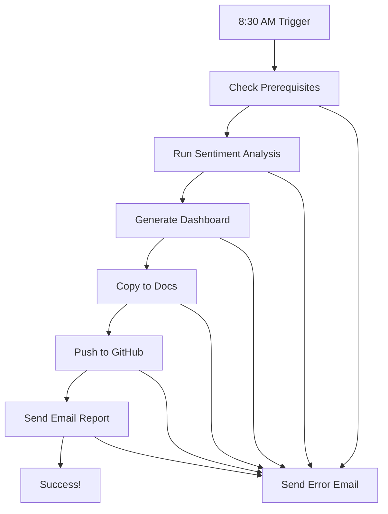

# 🤖 Tigro Daily Automation Guide

## 📋 Overview

This guide sets up **complete daily automation** for the Tigro sentiment analysis system. The automation will:

1. **Run Daily at 8:30 AM** - Automatically trigger the full pipeline
2. **Collect Sentiment Data** - Analyze news for 91 stocks using FinBERT AI
3. **Generate Dashboard** - Create updated HTML reports
4. **Push to GitHub** - Update the live dashboard at https://theemeraldnetwork.github.io/tigro/
5. **Send Email Report** - Deliver daily sentiment analysis via email
6. **Handle Errors** - Send notifications if anything fails

## 🚀 Quick Setup

### 1. Install the Automation (Primary Method - LaunchD)

```bash
# Run the setup script
python setup_daily_automation.py
```

This will:
- ✅ Install LaunchD service for macOS
- ✅ Configure daily scheduling at 8:30 AM
- ✅ Clean up old automation attempts
- ✅ Set up proper logging and error handling

### 2. Backup Method (Cron)

If LaunchD has issues, use the backup cron method:

```bash
# Install cron backup
python setup_cron_backup.py
```

## 📊 System Components

### Core Files

| File | Purpose |
|------|---------|
| `daily_automation.py` | Main automation script with retry logic |
| `setup_daily_automation.py` | LaunchD service installer |
| `setup_cron_backup.py` | Backup cron installer |
| `com.tigro.daily.plist` | LaunchD service configuration |
| `run_daily_automation.sh` | Cron wrapper script |

### Configuration Files

| File | Purpose |
|------|---------|
| `utils/config/email_config.json` | Gmail SMTP configuration |
| `utils/config/api_keys.json` | Finnhub/NewsAPI keys |
| `master name ticker.csv` | 91 stocks to analyze |

### Log Files

| File | Purpose |
|------|---------|
| `logs/daily_automation_YYYYMMDD.log` | Daily automation logs |
| `logs/tigro_daily.log` | LaunchD service logs |
| `logs/cron_daily.log` | Cron job logs |

## 🛠️ Manual Testing

### Test Daily Automation

```bash
# Test the automation script manually
python daily_automation.py
```

### Test Individual Components

```bash
# Test sentiment analysis only
python scripts/a_collect_sentiment.py

# Test dashboard generation only
python scripts/e_generate_dashboard.py

# Test email system only
python -c "from utils.email.report_sender import SentimentEmailSender; import pandas as pd; sender = SentimentEmailSender(); df = pd.read_csv('results/sentiment_summary_latest.csv'); sender.send_email(df, test_mode=False)"
```

## 📅 Scheduling Details

### LaunchD Configuration

- **Service Name**: `com.tigro.daily`
- **Schedule**: Daily at 8:30 AM
- **Working Directory**: Your project folder
- **Python Environment**: Uses your virtual environment
- **Logging**: Comprehensive logging with rotation

### Cron Backup Configuration

- **Cron Expression**: `30 8 * * *` (8:30 AM daily)
- **Wrapper Script**: `run_daily_automation.sh`
- **Environment**: Properly configured PATH and PYTHONPATH

## 🔧 Service Management

### LaunchD Commands

```bash
# Check service status
launchctl list com.tigro.daily

# Manually load service
launchctl load ~/Library/LaunchAgents/com.tigro.daily.plist

# Manually unload service
launchctl unload ~/Library/LaunchAgents/com.tigro.daily.plist

# View service logs
tail -f logs/tigro_daily.log
```

### Cron Commands

```bash
# View current cron jobs
crontab -l

# Edit cron jobs
crontab -e

# View cron logs
tail -f logs/cron_daily.log
```

## 📧 Email Configuration

The system uses Gmail SMTP with the following configuration:

```json
{
    "smtp_server": "smtp.gmail.com",
    "smtp_port": 587,
    "email_address": "davideconsiglio1978@gmail.com",
    "app_password": "yapl pqyf rzpp olbr",
    "recipient_email": "davideconsiglio1978@gmail.com",
    "sender_name": "Tigro Daily Sentiment Analysis",
    "subject_prefix": "Daily Tigro Sentiment Report",
    "github_base_url": "https://theemeraldnetwork.github.io/tigro"
}
```

## 🚨 Error Handling

The automation includes comprehensive error handling:

### Retry Logic
- **API Failures**: 3 retries with exponential backoff
- **Network Issues**: Automatic retry with delays
- **GitHub Push**: Multiple attempts with different strategies

### Error Notifications
- **Email Alerts**: Sent when automation fails
- **Detailed Logs**: All errors logged with timestamps
- **Recovery Instructions**: Clear next steps provided

### Common Issues & Solutions

| Issue | Solution |
|-------|----------|
| API Key Expired | Update `utils/config/api_keys.json` |
| GitHub Push Failed | Check git credentials and network |
| Email Delivery Failed | Verify Gmail app password |
| Virtual Environment Issues | Recreate venv and reinstall requirements |

## 📊 Monitoring & Maintenance

### Daily Monitoring

```bash
# Check today's logs
tail -f logs/daily_automation_$(date +%Y%m%d).log

# Check service status
launchctl list com.tigro.daily

# Verify email delivery
# Check your email inbox for daily reports
```

### Weekly Maintenance

```bash
# Check log file sizes
ls -lh logs/

# Review error patterns
grep -i error logs/daily_automation_*.log

# Test manual execution
python daily_automation.py
```

### Monthly Maintenance

```bash
# Clean up old logs (automatic, but can be manual)
find logs/ -name "daily_automation_*.log" -mtime +30 -delete

# Update dependencies
pip install -r requirements.txt --upgrade

# Verify API quotas
python test_finnhub.py
```

## 🎯 Success Metrics

A successful daily automation run should produce:

1. **📊 Updated Dashboard**: https://theemeraldnetwork.github.io/tigro/
2. **📧 Email Report**: Daily sentiment analysis in your inbox
3. **📈 Fresh Data**: Latest sentiment scores for 91 stocks
4. **🔄 Git History**: Daily commits with new data
5. **📝 Clean Logs**: No errors in automation logs

## 🔄 Automation Flow



## 📋 Troubleshooting Checklist

### Before Setup
- [ ] Python virtual environment activated
- [ ] All dependencies installed (`pip install -r requirements.txt`)
- [ ] API keys configured in `utils/config/api_keys.json`
- [ ] Email configuration in `utils/config/email_config.json`
- [ ] Git repository configured with proper credentials

### After Setup
- [ ] LaunchD service loaded successfully
- [ ] Test run completes without errors
- [ ] Email delivery works
- [ ] GitHub push succeeds
- [ ] Dashboard updates properly

### Daily Checks
- [ ] Check logs for errors
- [ ] Verify email delivery
- [ ] Confirm dashboard updates
- [ ] Monitor API quota usage

## 🚀 Getting Started

1. **Install**: `python setup_daily_automation.py`
2. **Test**: `python daily_automation.py`
3. **Monitor**: `tail -f logs/daily_automation_*.log`
4. **Verify**: Check email and dashboard tomorrow morning

## 📞 Support

If you encounter issues:

1. **Check Logs**: `tail -f logs/daily_automation_*.log`
2. **Test Manual**: `python daily_automation.py`
3. **Verify Config**: Check all configuration files
4. **Fallback**: Use cron backup if LaunchD fails
5. **Emergency**: Run `python master_runner_short.py` manually

---

**🐅 Tigro Daily Automation is now ready!**
Your sentiment analysis system will run automatically every day at 8:30 AM, keeping your dashboard fresh and delivering daily insights to your inbox. 