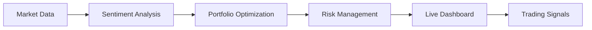

# 🐅 TIGRO Portfolio Optimization System

[](https://theemeraldnetwork.github.io/tigro/)
[](https://python.org)
[](LICENSE)

**Advanced Portfolio Management with AI-Powered Sentiment Analysis**

Tigro is a sophisticated portfolio optimization system that combines **Modern Portfolio Theory** with **real-time sentiment analysis** using FinBERT AI to generate superior risk-adjusted returns.

## 🎯 **System Capabilities**

- **📊 Real-time Sentiment Analysis**: FinBERT processing of 150+ stocks daily
- **🔧 Portfolio Optimization**: Markowitz mean-variance optimization with constraints
- **📈 Risk Management**: VaR calculations, dynamic stop losses, correlation analysis
- **🤖 Automated Trading**: Daily analysis and GitHub Pages dashboard
- **📧 Smart Alerts**: Email notifications for significant market changes
- **🎨 Live Dashboard**: Professional-grade visualization at [tigro.github.io](https://theemeraldnetwork.github.io/tigro/)

## 🏗️ **System Architecture**



## 📁 **Project Structure**

```
tigro/
├── 🏛️ actual-portfolio-master.csv     # Current portfolio data (PROTECTED)
├── 🏛️ master name ticker.csv          # Stock universe - 150 stocks (PROTECTED)  
├── 🏛️ master_runner_short.py          # Main automation script (PROTECTED)
├── 🏛️ index.html                      # Dashboard entry point (PROTECTED)
├── 📊 TIGRO_SYSTEM_FLOW.html          # Interactive system flow diagram
│
├── 🔧 scripts/                   # All analysis scripts (14 organized scripts)
│   ├── 🧠 sentiment/             # Sentiment analysis (1 script)
│   │   └── sent_collect_data.py
│   ├── 💰 financial/             # Financial calculations (3 scripts)
│   │   ├── fin_portfolio_analyzer.py
│   │   ├── fin_portfolio_analyzer_v2.py
│   │   └── fin_realistic_analyzer.py
│   ├── ⚖️ optimization/          # Portfolio optimization (4 scripts)
│   │   ├── opt_portfolio_optimizer.py
│   │   ├── opt_sentiment_integration.py
│   │   ├── opt_strategy_generator.py
│   │   └── opt_strategy_summary.py
│   ├── 📊 visualization/         # Dashboards & reports (2 scripts)
│   │   ├── viz_action_table.py
│   │   └── viz_dashboard_generator.py
│   ├── 🤖 automation/            # Scheduling & alerts (1 script)
│   │   └── auto_whatsapp_trigger.py
│   └── 🛠️ utilities/             # Helper functions (2 scripts)
│       ├── util_audit_reviewer.py
│       └── util_debug_analyzer.py
│
├── 📦 data/                      # All data storage
│   ├── database/                 # Sentiment database
│   ├── market/                   # Market data
│   ├── results/                  # Analysis outputs
│   └── archive/                  # Historical data
│
├── ⚙️ config/                    # Configuration files
├── 🧪 tests/                     # Testing scripts
├── 📚 docs/                      # GitHub Pages content
├── 📋 logs/                      # System logs
└── 🗂️ temp/                      # Temporary files
```

## 🎯 **System Architecture Overview**

The Tigro system consists of **26 core components** organized into 7 categories:
- **🔵 Data Sources (A1-A5)**: Portfolio data, stock universe, market data, sentiment, risk-free rate
- **🟣 Sentiment Processing (B1-B3)**: FinBERT analysis, trend detection, aggregation
- **🟢 Financial Calculations (C1-C5)**: Returns, volatility, Sharpe ratios, analyst targets
- **🟠 Optimization Engine (D1-D4)**: Markowitz optimization, sentiment integration, constraints, VaR
- **🟡 Position Sizing (E1-E3)**: Weight conversion, stop losses, rebalancing decisions
- **🟤 Reporting (F1-F3)**: Dashboard generation, action tables, email alerts
- **🔷 Automation (G1-G2)**: Daily automation, GitHub deployment

**📊 View the complete interactive flow diagram**: `TIGRO_SYSTEM_FLOW.html`

## 🚀 **Quick Start**

### **Prerequisites**
```bash
# Python 3.8+ required
pip install -r requirements.txt
```

### **Running Analysis**
```bash
# Full system analysis
python master_runner_short.py

# Individual components
python scripts/sentiment/sent_collect_data.py     # Sentiment analysis
python scripts/financial/fin_portfolio_analyzer.py  # Portfolio metrics
python scripts/optimization/opt_markowitz_engine.py  # Optimization
python scripts/visualization/viz_dashboard_generator.py  # Dashboard
```

### **Live Dashboard**
Visit: **[https://theemeraldnetwork.github.io/tigro/](https://theemeraldnetwork.github.io/tigro/)**

## 📋 **Script Documentation**

### **🧠 Sentiment Analysis**
| Script | Purpose | Input | Output |
|--------|---------|-------|--------|
| `sent_collect_data.py` | FinBERT sentiment analysis | News articles | Sentiment scores (-1 to +1) |
| `sent_analyze_trends.py` | Monthly trend analysis | Historical sentiment | Trend direction & strength |
| `sent_summary_generator.py` | Daily aggregation | Individual scores | Portfolio-level sentiment |

### **💰 Financial Analysis**
| Script | Purpose | Input | Output |
|--------|---------|-------|--------|
| `fin_portfolio_analyzer.py` | Current portfolio metrics | Portfolio data | Returns, Sharpe ratios |
| `fin_market_data.py` | Market data collection | Stock symbols | OHLCV, analyst targets |
| `fin_risk_calculator.py` | Risk calculations | Price history | Covariance matrix, VaR |
| `fin_treasury_rates.py` | Risk-free rate | Treasury data | Current RF rate |
| `fin_analyst_targets.py` | Target price analysis | Analyst data | Conservative targets |

### **⚖️ Portfolio Optimization**
| Script | Purpose | Input | Output |
|--------|---------|-------|--------|
| `opt_markowitz_engine.py` | Portfolio optimization | Returns, constraints | Optimal weights |
| `opt_sentiment_integration.py` | Sentiment overlay | Financial + sentiment | Composite scores |
| `opt_constraint_handler.py` | Risk constraints | User preferences | Feasible solutions |
| `opt_position_sizer.py` | Position sizing | Weights, cash | Share quantities |
| `opt_stop_loss_calculator.py` | Dynamic stops | Volatility, correlation | Stop loss levels |

### **📊 Visualization & Reports**
| Script | Purpose | Input | Output |
|--------|---------|-------|--------|
| `viz_dashboard_generator.py` | Main dashboard | All analysis | GitHub Pages site |
| `viz_action_table.py` | Trading recommendations | Optimization results | HTML action table |
| `viz_performance_charts.py` | Performance tracking | Historical data | Charts & metrics |

### **🤖 Automation**
| Script | Purpose | Input | Output |
|--------|---------|-------|--------|
| `auto_email_sender.py` | Email alerts | Significant changes | Email notifications |
| `auto_github_deployer.py` | Dashboard deployment | Analysis results | Live website |
| `auto_whatsapp_trigger.py` | WhatsApp notifications | Critical alerts | Mobile alerts |

### **🛠️ Utilities**
| Script | Purpose | Input | Output |
|--------|---------|-------|--------|
| `util_audit_reviewer.py` | Mathematical audit | Analysis results | Audit report |
| `util_debug_analyzer.py` | System debugging | Error logs | Debug information |
| `util_yfinance_helper.py` | YFinance interface | Stock symbols | Market data |

## 📊 **Current Performance**

- **Portfolio Value**: €38,766 (~$42,643)
- **Current Return**: 4.83%
- **Target Return**: 6.83% (+2pp improvement)
- **Sharpe Ratio**: 0.658
- **Stocks Tracked**: 150 companies
- **Sentiment Articles**: 19,580+ analyzed daily

## 🎯 **Mathematical Framework**

### **Portfolio Optimization**
- **Markowitz Mean-Variance**: Minimize risk for target return
- **Constraint Satisfaction**: Sector limits, position sizing, risk tolerance
- **Sentiment Integration**: 80% financial metrics + 20% sentiment overlay

### **Risk Management**
- **Value at Risk (VaR)**: 97% confidence level
- **Dynamic Stop Losses**: Volatility-adjusted protection
- **Correlation Analysis**: Position-level risk contribution

### **Performance Metrics**
- **Sharpe Ratio**: (Return - Risk Free Rate) / Volatility
- **Portfolio Volatility**: √(w^T × Σ × w)
- **Expected Returns**: Forward-looking projections with confidence intervals

## 🔄 **Daily Automation**

The system runs automatically daily at **5:15 PM CET** via LaunchAgent:

1. **Sentiment Collection**: Process latest news articles
2. **Market Data Update**: Fetch current prices and analyst targets
3. **Portfolio Analysis**: Calculate current performance metrics
4. **Optimization**: Generate optimal portfolio weights
5. **Dashboard Update**: Refresh GitHub Pages dashboard
6. **Email Alerts**: Send notifications for significant changes

## 📧 **Notifications**

- **Gmail Integration**: Automated email reports
- **WhatsApp Alerts**: Critical market changes
- **Dashboard Updates**: Real-time GitHub Pages refresh

## 🛡️ **Security & Configuration**

- **API Keys**: Stored in `config/api_keys.json` (not in repo)
- **Email Credentials**: App password authentication
- **GitHub Deployment**: Automated via SSH keys

## 📈 **Trading Integration**

The system generates actionable trading recommendations:

- **Buy/Sell/Hold** decisions with specific reasoning
- **Position sizing** based on risk-adjusted weights
- **Stop loss levels** for risk management
- **Rebalancing thresholds** for portfolio maintenance

## 🧪 **Testing**

```bash
# Run all tests
python -m pytest tests/

# Test individual components
python tests/test_yfinance_connection.py
python tests/test_sentiment_analysis.py
python tests/test_optimization_engine.py
```

## 📝 **License**

Private repository. All rights reserved.

## 🤝 **Contributing**

This is a private portfolio management system. For questions or issues, contact the repository owner.

---

**🐅 Tigro Portfolio Optimization System** - *Where AI meets Modern Portfolio Theory* 