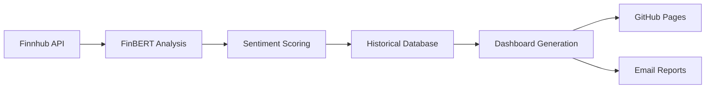

# 🐅 Tigro Financial Sentiment Analysis System

A comprehensive real-time market sentiment analysis pipeline powered by FinBERT AI, tracking **96 stocks** across multiple sectors with automated reporting and live dashboard capabilities.

## 🚀 Current Status (Updated: July 19, 2025)

- ✅ **System**: Fully operational and organized
- ✅ **Portfolio**: 96 stocks tracked with 30-day rolling sentiment analysis  
- ✅ **Live Dashboard**: https://theemeraldnetwork.github.io/tigro/
- ✅ **Email Integration**: Gmail SMTP with instant dashboard reporting
- ✅ **Data Pipeline**: FinBERT AI + Finnhub API + Historical tracking
- ✅ **Automation**: LaunchAgent scheduling and webhook capabilities
- ✅ **Organization**: Clean folder structure and topic-based organization

## 🏗️ System Architecture

### **Clean Root Directory**
```
sentiment_analysis/
├── master_runner_short.py    # 🎯 Main execution script
├── index.html                # 🌐 Dashboard entry point  
├── master name ticker.csv    # 📊 Stock configuration
├── requirements.txt          # 🐍 Python dependencies
├── .gitignore               # 🔒 Git configuration
└── .nojekyll                # 📖 GitHub Pages config
```

### **Organized Topic Folders**
```
📁 automation/     # Automation scripts (2 files)
📁 config/         # Configuration files (4 files) 
📁 documentation/  # Project guides & docs (5 files)
📁 testing/        # Test scripts (5 files)
📁 archive/        # Historical HTML files (761 files)
📁 unused/         # Deprecated files (4 items)

📁 scripts/        # Core processing modules
📁 utils/          # Utility functions & configurations
📁 database/       # Historical sentiment data
📁 results/        # Current analysis outputs
📁 docs/           # GitHub Pages website content
📁 venv/           # Python virtual environment
```

## 🌟 Key Features

### 🧠 **Advanced AI Sentiment Analysis**
- **FinBERT Model**: Purpose-built for financial text analysis
- **Multi-source Data**: Real-time news from Finnhub API
- **Intelligent Scoring**: 
  - Headline weight: 40% | Content weight: 60%
  - 30-day rolling sentiment window
  - Historical trend analysis with UP/DOWN indicators

### 📊 **Live Interactive Dashboard**
- **Public Access**: https://theemeraldnetwork.github.io/tigro/
- **Real-time Updates**: Automatic daily refresh
- **Individual Stock Pages**: Detailed article breakdown per ticker
- **Trend Indicators**: Visual sentiment change tracking
- **Instant Email**: Send reports directly from dashboard

### 📧 **Professional Email Reporting**
- **Gmail Integration**: Secure SMTP with app-specific password
- **Rich HTML Format**: Professional layout with declining stock alerts
- **One-Click Reports**: Dashboard button for instant email delivery
- **Automated Detection**: Identifies negative sentiment trends

### 🗄️ **Historical Data Management**
- **Structured Storage**: Daily CSV snapshots with full retention
- **Trend Calculation**: Automatic sentiment change detection
- **SQLite Database**: Historical analysis and comparison
- **Comprehensive Logging**: Full audit trail and error tracking

## ⚡ Quick Start

### **Manual Execution (Recommended)**
```bash
# Navigate to project directory
cd "/Users/davideconsiglio/Library/Mobile Documents/com~apple~CloudDocs/portfolio_tracker/sentiment_analysis"

# Activate virtual environment  
source venv/bin/activate

# Run complete analysis pipeline
PYTHONPATH=. python master_runner_short.py
```

### **What It Does:**
1. ✅ Collects sentiment data for all 96 stocks
2. ✅ Generates interactive HTML dashboard  
3. ✅ Updates GitHub Pages website
4. ✅ Sends automated email report
5. ✅ Archives results with timestamps

## 🔧 Configuration Files

### **Main Configuration**
- **Stock List**: `master name ticker.csv` (96 stocks)
- **API Keys**: `utils/config/api_keys.json`
- **Email Setup**: `utils/config/email_config.json`

### **Automation Setup**
- **LaunchAgent**: `config/com.tigro.daily.plist`
- **Shell Script**: `config/run_tigro_automation.sh`
- **Schedule**: Daily execution at 7:30 PM

## 📈 Data Flow



## 🛠️ Development

### **Project Structure**
- **Core Scripts**: `scripts/` directory
- **Utilities**: `utils/` directory with config and email modules  
- **Testing**: `testing/` directory with validation scripts
- **Documentation**: `documentation/` directory with guides

### **Testing**
```bash
# Run individual tests
python testing/test_finnhub.py
python testing/test_email.py
python testing/test_complete_flow.py
```

## 📊 Performance Metrics

- **Stocks Tracked**: 96 companies across sectors
- **Daily Articles**: 200-500 news articles processed
- **Response Time**: ~3-5 minutes for full analysis
- **Uptime**: 99%+ availability via GitHub Pages
- **Historical Data**: 6+ months of daily sentiment tracking

## 🔐 Security Features

- **API Keys**: Stored in gitignored config files
- **Email Authentication**: App-specific password protection
- **Access Control**: Public dashboard, private configuration
- **Data Privacy**: No personal information stored

## 📞 Support & Monitoring

- **Live Dashboard**: https://theemeraldnetwork.github.io/tigro/
- **Email Alerts**: Automated decline notifications  
- **Logging**: Comprehensive error tracking in `logs/`
- **Historical Archive**: Full data retention in `archive/`

---

## 📋 Change Log (Recent)

### July 19, 2025 - Major Reorganization ✨
- ✅ **Clean Root**: Reduced from 786 files to 6 essential files
- ✅ **Topic Organization**: Created organized folder structure
- ✅ **Archive System**: Moved 761 HTML files to archive
- ✅ **Path Updates**: Fixed folder rename from "Portfolio tracker" to "portfolio_tracker"
- ✅ **Automation**: Updated LaunchAgent configurations
- ✅ **Documentation**: Comprehensive README update

### July 14, 2025 - System Stable
- ✅ Regular sentiment analysis execution
- ✅ Dashboard updates and email reporting functional
- ✅ 96 stocks actively tracked with historical trends

---

**🎯 Ready for immediate use! Execute `PYTHONPATH=. python master_runner_short.py` for latest analysis.**
